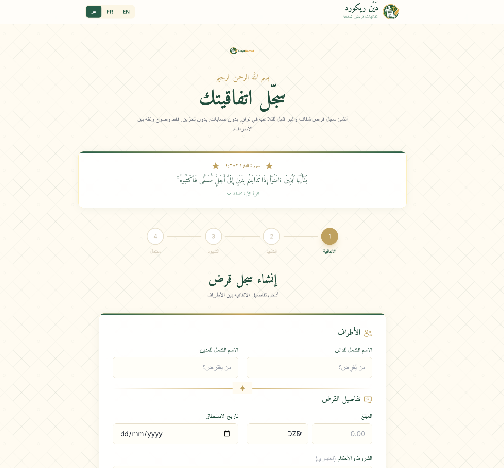
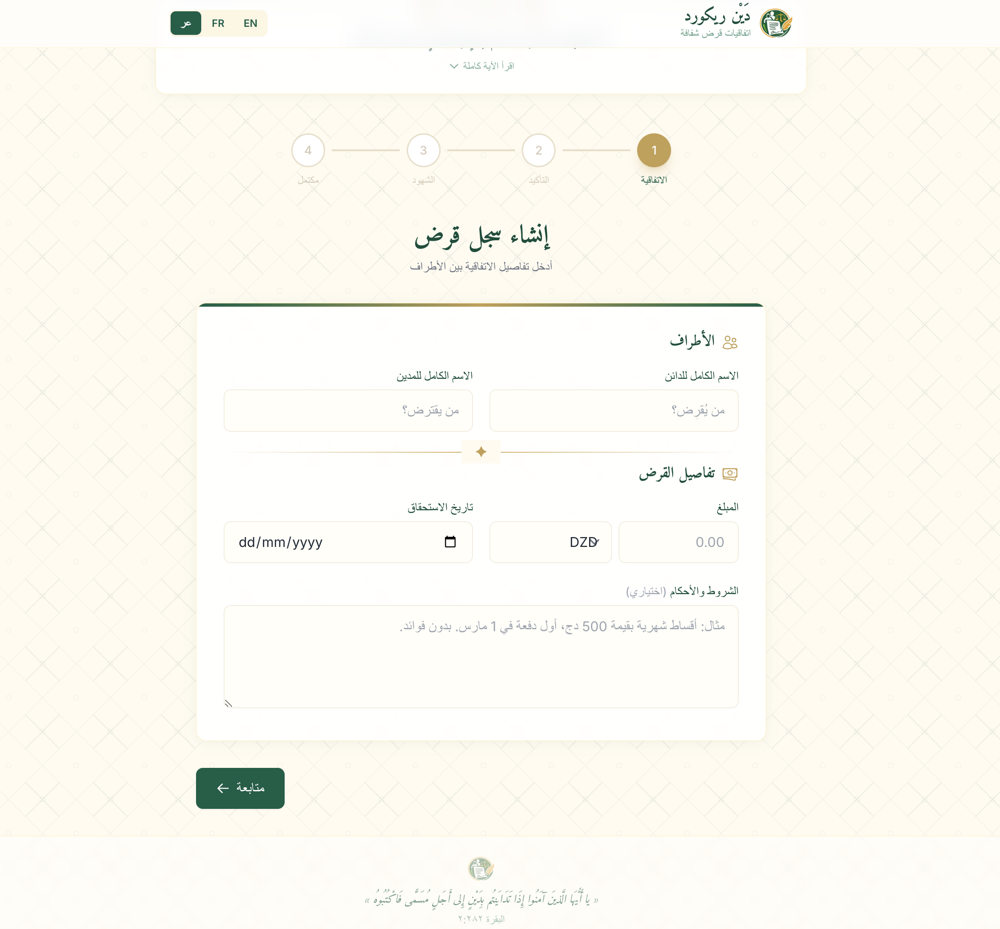
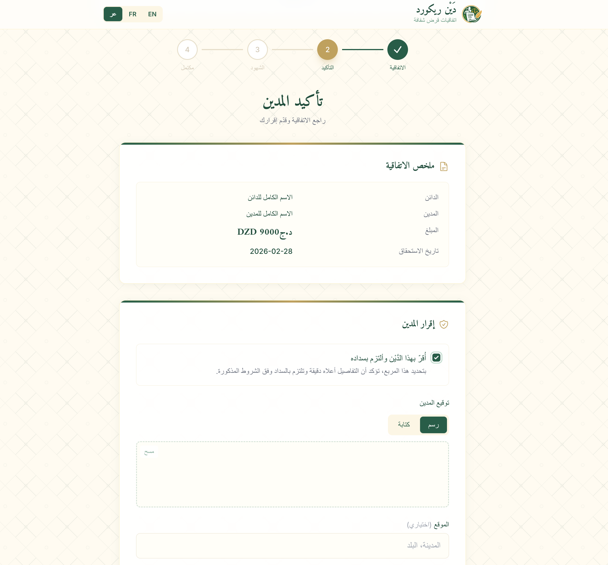
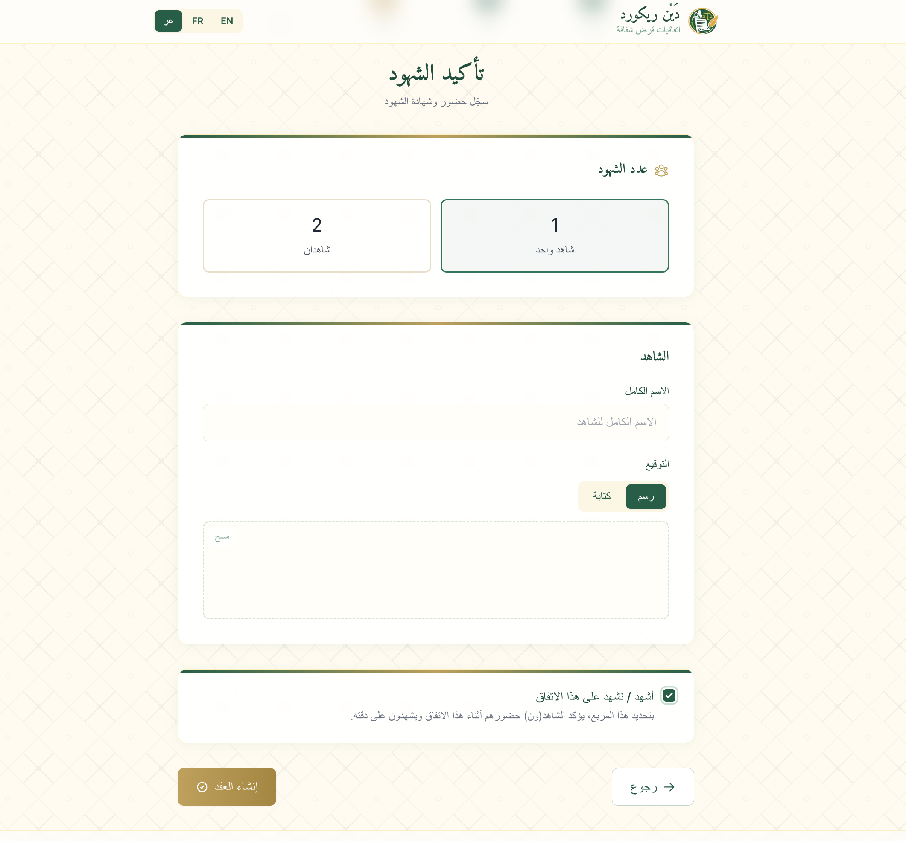
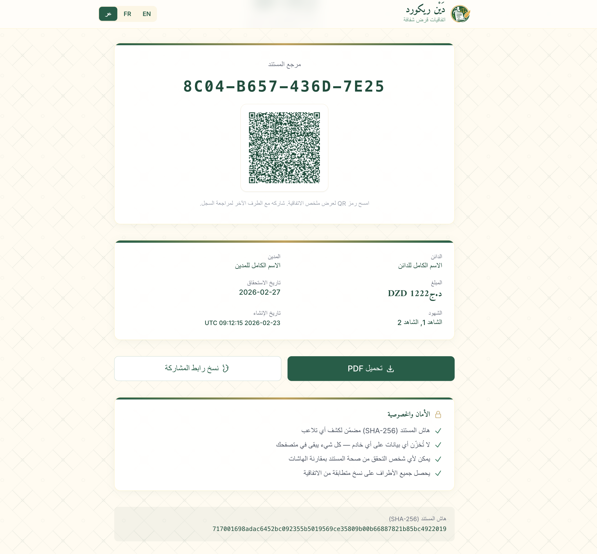
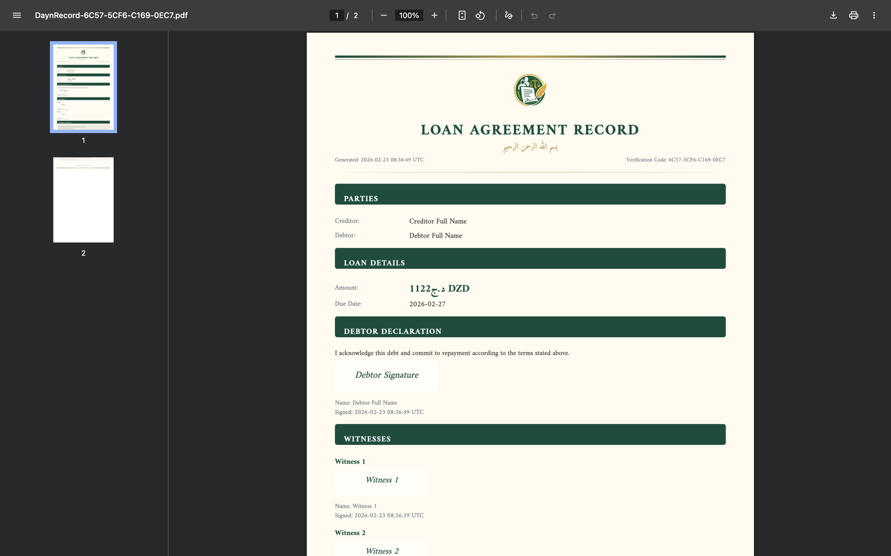

<p align="center">
  
</p>

<p align="center">
  <strong>Transparent, tamper-evident loan agreements — inspired by Al-Baqarah 2:282</strong>
</p>

<p align="center">
  <em>"O you who believe! When you contract a debt for a specified term, write it down."</em><br/>
  <sub>— Quran 2:282</sub>
</p>

<p align="center">
  <a href="#features">Features</a> •
  <a href="#screenshots">Screenshots</a> •
  <a href="#getting-started">Getting Started</a> •
  <a href="#tech-stack">Tech Stack</a> •
  <a href="#how-it-works">How It Works</a> •
  <a href="#deployment">Deployment</a> •
  <a href="#author">Author</a>
</p>

---

## What is DaynRecord?

**DaynRecord** (دَيْن ريكورد) is a free, privacy-first web application for generating transparent loan agreements between parties. The word **"Dayn"** (دَيْن) means "debt" in Arabic.

Inspired by the longest verse in the Quran (Al-Baqarah 2:282), which instructs believers to document debts in writing with witnesses, DaynRecord digitizes this practice with modern cryptographic integrity — while storing **zero data** on any server.

**No accounts. No servers. No data stored. Just clarity and trust.**

## Features

- **4-Step Guided Wizard** — Agreement details → Debtor confirmation → Witness signatures → Generated record
- **Tamper-Evident Documents** — Every agreement is SHA-256 hashed using the Web Crypto API
- **PDF Generation** — Professional multi-page PDF with all agreement details, signatures, and QR code
- **QR Code Verification** — Scannable QR code links directly to the agreement summary for easy sharing
- **Digital Signatures** — Draw or type signatures for debtor and witnesses
- **Multi-Language** — Full support for English, French, and Arabic (with RTL layout)
- **Offline Capable (PWA)** — Install as a native app, works without internet
- **Mobile-First Design** — Responsive UI optimized for phones and tablets
- **Islamic Design Aesthetic** — Custom theme with geometric patterns, Arabic calligraphy fonts, and gold/green palette
- **100% Client-Side** — All processing happens in the browser; nothing leaves your device
- **Shareable Links** — Generate lightweight share links for quick agreement review

## Screenshots

<table>
  <tr>
    <td align="center" width="50%">
      <br/>
      <sub><b>Home Page</b> — Hero section with Quranic verse and step wizard</sub>
    </td>
    <td align="center" width="50%">
      <br/>
      <sub><b>Agreement Form</b> — Enter parties, amount, due date, and terms</sub>
    </td>
  </tr>
  <tr>
    <td align="center" width="50%">
      <br/>
      <sub><b>Debtor Confirmation</b> — Review summary, acknowledge debt, and sign</sub>
    </td>
    <td align="center" width="50%">
      <br/>
      <sub><b>Witness Confirmation</b> — Add 1-2 witnesses with names and signatures</sub>
    </td>
  </tr>
  <tr>
    <td align="center" width="50%">
      <br/>
      <sub><b>Generated Record</b> — QR code, document reference, share & download</sub>
    </td>
    <td align="center" width="50%">
      <br/>
      <sub><b>PDF Document</b> — Professional multi-page loan agreement PDF</sub>
    </td>
  </tr>
</table>

## Tech Stack

| Technology | Purpose |
|---|---|
| [Next.js 15](https://nextjs.org/) | React framework with App Router |
| [React 19](https://react.dev/) | UI library |
| [TypeScript 5](https://www.typescriptlang.org/) | Type safety |
| [Tailwind CSS 3](https://tailwindcss.com/) | Utility-first styling |
| [jsPDF](https://github.com/parallax/jsPDF) + [html2canvas](https://html2canvas.hertzen.com/) | PDF generation with full Unicode support |
| [signature_pad](https://github.com/szimek/signature_pad) | Canvas-based digital signatures |
| [qrcode.react](https://github.com/zpao/qrcode.react) | QR code generation |
| [Web Crypto API](https://developer.mozilla.org/en-US/docs/Web/API/Web_Crypto_API) | SHA-256 document hashing |

## How It Works

```
┌─────────────────────────────────────────────────────┐
│                    DaynRecord Flow                   │
├─────────────────────────────────────────────────────┤
│                                                     │
│  Step 1: Agreement Details                          │
│  ├─ Creditor name                                   │
│  ├─ Debtor name                                     │
│  ├─ Loan amount + currency                          │
│  ├─ Due date                                        │
│  └─ Terms & conditions (optional)                   │
│                                                     │
│  Step 2: Debtor Confirmation                        │
│  ├─ Review agreement summary                        │
│  ├─ Acknowledge debt (checkbox)                     │
│  └─ Digital signature (draw or type)                │
│                                                     │
│  Step 3: Witness Confirmation                       │
│  ├─ Select 1 or 2 witnesses                         │
│  ├─ Witness name + signature                        │
│  └─ Witness attestation (checkbox)                  │
│                                                     │
│  Step 4: Generated Record                           │
│  ├─ SHA-256 hash of entire agreement                │
│  ├─ Unique document reference code                  │
│  ├─ QR code → links to agreement summary            │
│  ├─ Copy shareable link                             │
│  └─ Download PDF                                    │
│                                                     │
│  ┌───────────────────────────────────────────────┐  │
│  │ Privacy: ALL data stays in your browser.      │  │
│  │ Nothing is sent to any server. Ever.          │  │
│  └───────────────────────────────────────────────┘  │
└─────────────────────────────────────────────────────┘
```

### Tamper Evidence

The entire agreement (including signatures, timestamps, and witness data) is hashed using **SHA-256** via the Web Crypto API. This hash is embedded in both the PDF and QR code. If even a single character is altered, the hash will no longer match — making tampering immediately detectable.

## Getting Started

### Prerequisites

- [Node.js](https://nodejs.org/) 18+ 
- [npm](https://www.npmjs.com/) or [yarn](https://yarnpkg.com/)

### Installation

```bash
# Clone the repository
git clone https://github.com/ZineddineBk09/daynrecord.git
cd daynrecord

# Install dependencies
npm install

# Start development server
npm run dev
```

Open [http://localhost:3000](http://localhost:3000) in your browser.

### Environment Variables

Create a `.env.local` file in the root directory:

```env
# Your deployed site URL (used for SEO metadata and canonical URLs)
NEXT_PUBLIC_SITE_URL=https://your-domain.com

# Secret key for accessing the analytics dashboard at /stats
ANALYTICS_SECRET=your-secret-key

# (Optional) Google Search Console verification
GOOGLE_SITE_VERIFICATION=your-verification-code
```

### Build for Production

```bash
npm run build
npm start
```

## Project Structure

```
daynrecord/
├── public/
│   ├── logo/                    # App logos (full, no-text, text variants)
│   ├── screenshots/             # App screenshots
│   ├── icons/                   # PWA icons
│   ├── manifest.json            # PWA manifest
│   ├── robots.txt               # Search engine crawling rules
│   └── sw.js                    # Service Worker for offline support
├── src/
│   ├── app/
│   │   ├── layout.tsx           # Root layout (metadata, fonts, SEO, JSON-LD)
│   │   ├── page.tsx             # Home page with wizard flow
│   │   ├── sitemap.ts           # Dynamic sitemap generation
│   │   ├── opengraph-image.tsx  # Auto-generated OG image
│   │   ├── not-found.tsx        # Custom 404 page
│   │   ├── error.tsx            # Error boundary page
│   │   ├── global-error.tsx     # Root error boundary
│   │   ├── verify/              # Agreement verification page
│   │   ├── stats/               # Analytics dashboard (private)
│   │   └── api/track/           # Analytics tracking endpoint
│   ├── components/
│   │   ├── AgreementForm.tsx    # Step 1: Loan agreement form
│   │   ├── DebtorConfirmation.tsx # Step 2: Debtor review & sign
│   │   ├── WitnessConfirmation.tsx # Step 3: Witness attestation
│   │   ├── GeneratedRecord.tsx  # Step 4: Final record with QR & PDF
│   │   ├── WizardFlow.tsx       # Multi-step wizard orchestrator
│   │   ├── StepIndicator.tsx    # Progress indicator
│   │   ├── SignaturePad.tsx     # Draw/type signature component
│   │   ├── VerseCard.tsx        # Quranic verse display
│   │   ├── LanguageSelector.tsx # EN/FR/AR language switcher
│   │   ├── IslamicBorder.tsx    # Decorative border component
│   │   ├── OfflineGuard.tsx     # Offline detection & UI
│   │   └── ServiceWorkerRegister.tsx # PWA service worker registration
│   ├── hooks/
│   │   └── useWizard.ts         # Wizard state management hook
│   └── lib/
│       ├── translations.ts      # i18n strings (EN, FR, AR)
│       ├── i18n.tsx             # i18n React context & provider
│       ├── pdf.ts               # PDF generation logic
│       ├── hash.ts              # SHA-256 hashing utilities
│       ├── analytics.ts         # Client-side event tracking
│       ├── types.ts             # TypeScript type definitions
│       └── utils.ts             # Shared utility functions
└── package.json
```

## Deployment

### Netlify (Recommended)

1. Push your code to GitHub
2. Connect the repository to [Netlify](https://www.netlify.com/)
3. Set build settings:
   - **Build command:** `npm run build`
   - **Publish directory:** `.next`
4. Add environment variables in Netlify dashboard:
   - `NEXT_PUBLIC_SITE_URL` — your Netlify domain
   - `ANALYTICS_SECRET` — secret key for the `/stats` dashboard

### Vercel

```bash
npx vercel
```

### Other Platforms

Any platform that supports Next.js 15 will work. Make sure to set the environment variables accordingly.

## Analytics

DaynRecord includes a lightweight, built-in analytics system that tracks:

| Event | Description |
|---|---|
| `contract_generated` | A loan agreement was successfully created |
| `pdf_downloaded` | The PDF document was downloaded |
| `share_link_copied` | The share link was copied to clipboard |

Access the dashboard at `/stats` using the `ANALYTICS_SECRET` you configured. No external analytics services are required.

## Privacy & Security

- **Zero server storage** — All agreement data lives exclusively in the browser
- **No cookies or tracking** — No third-party scripts, no fingerprinting
- **SHA-256 integrity** — Cryptographic hash ensures documents haven't been tampered with
- **Client-side only** — Signatures, PDFs, and QR codes are all generated locally
- **Open source** — Full transparency into how your data is handled

## Multi-Language Support

| Language | Code | Direction |
|---|---|---|
| English | `en` | LTR |
| French | `fr` | LTR |
| Arabic | `ar` | RTL |

The entire UI, form labels, error messages, PDF content, and Quranic verse adapt to the selected language. Arabic mode automatically switches to right-to-left layout.

## Contributing

Contributions are welcome! Feel free to:

1. Fork the repository
2. Create a feature branch (`git checkout -b feature/amazing-feature`)
3. Commit your changes (`git commit -m 'Add amazing feature'`)
4. Push to the branch (`git push origin feature/amazing-feature`)
5. Open a Pull Request

## License

This project is open source and available under the [MIT License](LICENSE).

## Author

**Zineddine Benkhaled**

- GitHub: [@ZineddineBk09](https://github.com/ZineddineBk09)

---

<p align="center">
  <br/>
  <sub>Built with purpose and prayer</sub>
</p>
